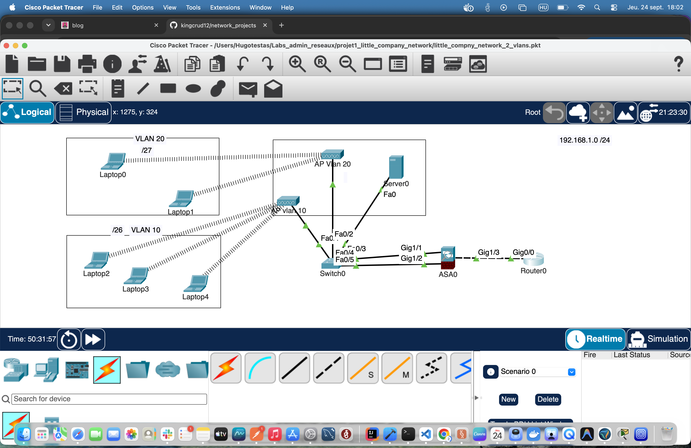

# Projet 1 : réseau d'une petite entreprise (2 VLANs)

Lab Cisco Packet Tracer : le réseau d'une petite entreprise, avec un réseau **interne** et un réseau **Wi‑Fi invités** séparés par VLAN et isolés par un pare-feu Cisco ASA.

> Fichier : [`little_compny_network_2_vlans.pkt`](little_compny_network_2_vlans.pkt), créé avec **Packet Tracer 9.0**.
> Configurations complètes des équipements : [Switch0](configs/switch0_2960.md) · [Router0](configs/router0_2911.md) · [ASA0](configs/asa0_5506x.md). Consignes du projet : [consignes.md](consignes.md).

---

## Objectifs

- Segmenter le réseau en deux VLANs : interne et invités
- Filtrer les flux entre les zones avec un pare-feu ASA (security-levels)
- Distribuer les adresses IP par DHCP sur chaque zone
- Découper l'adressage en sous-réseaux (VLSM) à partir de `192.168.1.0/24`
- Assurer le routage vers l'extérieur via un routeur de bordure

---

## Topologie



```
                         ┌──────────────┐
                         │   Router0    │  Cisco 2911
                         │  (bordure)   │
                         └──────┬───────┘
                         Gi0/0  │ 10.0.0.1/30
                                │
                         Gi1/3  │ 10.0.0.2/30  (OUTSIDE, sec-level 0)
                         ┌──────┴───────┐
                         │     ASA0     │  Cisco ASA 5506-X
                         │ (pare-feu)   │
                         └──┬────────┬──┘
     INTERNE (sec 100) Gi1/1│        │Gi1/2  WIFI-GUEST (sec 50)
          192.168.1.1/26    │        │    192.168.1.65/27
                        Fa0/4        Fa0/5
                         ┌──┴────────┴──┐
                         │   Switch0    │  Cisco 2960-24TT
                         └─┬────┬─────┬─┘
                      Fa0/3│    │Fa0/1│Fa0/2
                           │    │     │
                    ┌──────┘    │     └───────────┐
                    │           │                 │
               ┌────┴────┐ ┌────┴──────┐   ┌──────┴──────┐
               │ Server0 │ │ AP vlan10 │   │ AP Vlan 20  │
               │ .1.2/26 │ │  SSID     │   │  SSID       │
               └─────────┘ │ "INTERNE" │   │"WIFI-GUEST" │
                           └────┬──────┘   └──────┬──────┘
                                ┊ Wi‑Fi           ┊ Wi‑Fi
                         Laptop2/3/4         Laptop0/1
```

---

## Plan d'adressage

| Zone                  | VLAN | Réseau            | Masque          | Passerelle           | Plage utilisable | DHCP                             |
| --------------------- | ---- | ----------------- | --------------- | -------------------- | ---------------- | -------------------------------- |
| Interne               | 10   | `192.168.1.0/26`  | 255.255.255.192 | `192.168.1.1` (ASA)  | .1 à .62         | Server0 : `.3` à `.59`           |
| Wi‑Fi invités         | 20   | `192.168.1.64/27` | 255.255.255.224 | `192.168.1.65` (ASA) | .65 à .94        | ASA : `.67` à `.94`, DNS 8.8.8.8 |
| Transit ASA ↔ routeur | –    | `10.0.0.0/30`     | 255.255.255.252 | –                    | .1 à .2          | –                                |

### Adresses des équipements

| Équipement      | Interface            | Adresse IP            | Rôle                                                        |
| --------------- | -------------------- | --------------------- | ----------------------------------------------------------- |
| Router0         | Gi0/0                | 10.0.0.1/30           | Lien vers le pare-feu                                       |
| ASA0            | Gi1/1 (`INTERNE`)    | 192.168.1.1/26        | Passerelle du VLAN 10                                       |
| ASA0            | Gi1/2 (`WIFI-GUEST`) | 192.168.1.65/27       | Passerelle du VLAN 20, serveur DHCP invités                 |
| ASA0            | Gi1/3 (`OUTSIDE`)    | 10.0.0.2/30           | Lien vers le routeur                                        |
| Server0         | Fa0                  | 192.168.1.2/26 (fixe) | DHCP interne, HTTP/HTTPS, FTP, TFTP, SMTP/POP3, NTP, Syslog |
| Laptop2 / 3 / 4 | Wi‑Fi                | 192.168.1.3 / .4 / .5 | Postes internes (DHCP)                                      |
| Laptop0         | Wi‑Fi                | 192.168.1.68          | Invité (DHCP)                                               |
| Laptop1         | Wi‑Fi                | 192.168.1.67 (fixe)   | Invité                                                      |

---

## Configuration des équipements

### Switch0 (Cisco 2960-24TT)

| Port  | VLAN | Branché à                      |
| ----- | ---- | ------------------------------ |
| Fa0/1 | 10   | AP vlan 10 (SSID `INTERNE`)    |
| Fa0/2 | 20   | AP Vlan 20 (SSID `WIFI-GUEST`) |
| Fa0/3 | 10   | Server0                        |
| Fa0/4 | 10   | ASA0 Gi1/1 (INTERNE)           |
| Fa0/5 | 20   | ASA0 Gi1/2 (WIFI-GUEST)        |

Tous les ports sont en mode **access** : chaque VLAN arrive sur une interface physique distincte de l'ASA, donc aucun trunk n'est nécessaire.

```
interface FastEthernet0/1
 description VLAN 10
 switchport access vlan 10
 switchport mode access
!
interface FastEthernet0/2
 description VLAN 20
 switchport access vlan 20
 switchport mode access
```

### ASA0 (Cisco ASA 5506-X, pare-feu)

| Interface | nameif     | security-level | IP              |
| --------- | ---------- | -------------- | --------------- |
| Gi1/1     | INTERNE    | 100            | 192.168.1.1/26  |
| Gi1/2     | WIFI-GUEST | 50             | 192.168.1.65/27 |
| Gi1/3     | OUTSIDE    | 0              | 10.0.0.2/30     |

```
route OUTSIDE 0.0.0.0 0.0.0.0 10.0.0.1 1

dhcpd address 192.168.1.67-192.168.1.94 WIFI-GUEST
dhcpd dns 8.8.8.8 interface WIFI-GUEST
dhcpd enable WIFI-GUEST
```

**Politique de sécurité** (comportement par défaut de l'ASA, sans ACL) :

| Source → Destination               | Autorisé ?                                         |
| ---------------------------------- | -------------------------------------------------- |
| INTERNE (100) → WIFI-GUEST (50)    | Oui                                                |
| INTERNE (100) → OUTSIDE (0)        | Oui                                                |
| WIFI-GUEST (50) → OUTSIDE (0)      | Oui                                                |
| WIFI-GUEST (50) → INTERNE (100)    | Non : les invités n'accèdent pas au réseau interne |
| OUTSIDE (0) → INTERNE / WIFI-GUEST | Non (sauf réponses aux sessions ouvertes)          |

### Router0 (Cisco 2911)

```
interface GigabitEthernet0/0
 description FIREWALL LINK
 ip address 10.0.0.1 255.255.255.252
!
ip route 192.168.1.0  255.255.255.192 10.0.0.2
ip route 192.168.1.64 255.255.255.224 10.0.0.2
```

Des routes statiques renvoient les deux sous-réseaux internes vers l'ASA.

### Wi‑Fi

| Point d'accès | SSID         | Sécurité | VLAN |
| ------------- | ------------ | -------- | ---- |
| AP vlan 10    | `INTERNE`    | WPA2-PSK | 10   |
| AP Vlan 20    | `WIFI-GUEST` | WPA2-PSK | 20   |

> Les clés Wi‑Fi ne sont volontairement pas publiées dans ce README.

---

## Tests de validation

Depuis les laptops, dans Packet Tracer (_Desktop → Command Prompt_) :

| Test                            | Commande                          | Résultat attendu                                  |
| ------------------------------- | --------------------------------- | ------------------------------------------------- |
| Un poste interne obtient une IP | `ipconfig` sur Laptop2            | IP en 192.168.1.x/26, passerelle 192.168.1.1      |
| Un invité obtient une IP        | `ipconfig` sur Laptop0            | IP en 192.168.1.67 à .94, passerelle 192.168.1.65 |
| Interne → passerelle            | `ping 192.168.1.1`                |                                                   |
| Interne → serveur               | `ping 192.168.1.2`                |                                                   |
| Invité → serveur interne        | `ping 192.168.1.2` depuis Laptop0 | bloqué par l'ASA                                  |

Sur l'ASA : `show interface ip brief`, `show route`, `show dhcpd binding`.
Sur le switch : `show vlan brief`.

> ℹ Par défaut, l'ASA n'inspecte pas l'ICMP : un ping qui **traverse** le pare-feu (par exemple interne → 10.0.0.1) échoue, même si le routage est correct. Pour l'autoriser, il faut ajouter `inspect icmp` dans la `policy-map global_policy`.

---

## Pistes d'amélioration

- [ ] Ajouter `inspect icmp` sur l'ASA pour les tests de connectivité
- [ ] Configurer le NAT sur l'ASA (ou sur le routeur) pour un vrai accès Internet
- [ ] Laptop1 a une IP fixe (`.67`) **dans** la plage DHCP invités, ce qui peut créer un conflit : il faut l'exclure de la plage ou passer Laptop1 en DHCP
- [ ] Les deux AP émettent sur le **canal 6** : les placer sur des canaux distincts (1 / 6 / 11)
- [ ] Renseigner un serveur DNS dans le pool DHCP interne
- [ ] Durcir les équipements : `hostname`, `enable secret`, SSH, `service password-encryption`, bannière
- [ ] Désactiver et affecter à un VLAN « poubelle » les ports inutilisés du switch

---

## Structure du dépôt

```
.
├── README.md
├── consignes.md                        # Consignes du projet
├── little_compny_network_2_vlans.pkt   # Projet Packet Tracer 9.0
├── configs/
│   ├── switch0_2960.md                 # running-config Switch0
│   ├── router0_2911.md                 # running-config Router0
│   └── asa0_5506x.md                   # running-config ASA0
└── rendus/
    ├── rendu_final.png                 # Capture de la topologie
    ├── interfaces_switch.png
    └── vlans.png
```

## Ouvrir le projet

1. Installer [Cisco Packet Tracer](https://www.netacad.com/cisco-packet-tracer) 9.0 ou plus récent
2. Ouvrir `little_compny_network_2_vlans.pkt`
3. Laisser la simulation converger quelques secondes (DHCP, association Wi‑Fi)
